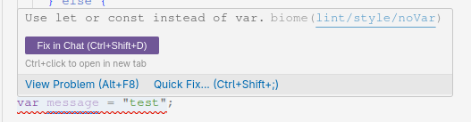

# Biome

[Biome](https://biomejs.dev/fr/) est un linter et un formatter extrêmement rapide et efficace.

!!! question "Un linteur? Un formatter?"

    Un linteur est un outil qui analyse le code source pour trouver des erreurs de syntaxe, de style, ou des problèmes de sémantique. Un formatter est un outil qui réorganise le code source pour le rendre plus lisible, et faire en sorte qu'il n'y ait qu'une seule façon de faire les choses.

## Comment l'utiliser?

Biome est configuré avec un fichier de configuration dans le projet. Il est automatiquement lancé lorsque vous committez votre code, si vous avez Lefthook configuré, ainsi que dans la CI côté GitHub Actions.

Heureusement, on n'est pas obligés d'attendre de commit pour lancer Biome: on peut l'avoir en permanence dans l'IDE !

!!! info "Plugins Biome"

    [VScode :material-microsoft-visual-studio-code:](https://marketplace.visualstudio.com/items?itemName=biomejs.biome){ .md-button }
    [IntelliJ/Webstorm :simple-intellijidea: :simple-webstorm:](https://plugins.jetbrains.com/plugin/22761-biome){ .md-button }
    [Autres IDEs :material-language-javascript:](https://biomejs.dev/fr/guides/editors/third-party-extensions/){ .md-button }

!!! example "Biome dans l'IDE"

    Par exemple, si vous enfreignez une règle de Biome, vous verrez un message comme celui-ci dans l'IDE:

    

    Ici, j'ai déclaré une variable avec `var` au lieu de `const` ou `let`. Biome me signale l'erreur en rouge.

## Utilisation dans le projet

Vous pouvez lancer le formatteur de Biome manuellement avec la commande suivante:

```bash
npm run format
```

Vous pouvez également lancer le linter de Biome avec la commande suivante:

```bash
npm run lint
```

### Avec le hook Lefthook
Lorsque vous committez votre code, Biome lancera la commande suivante:

```bash
npx biome ci
```

Cette commande lancera le linter et le formatter de Biome. Si vous avez des erreurs, le commit sera refusé.
